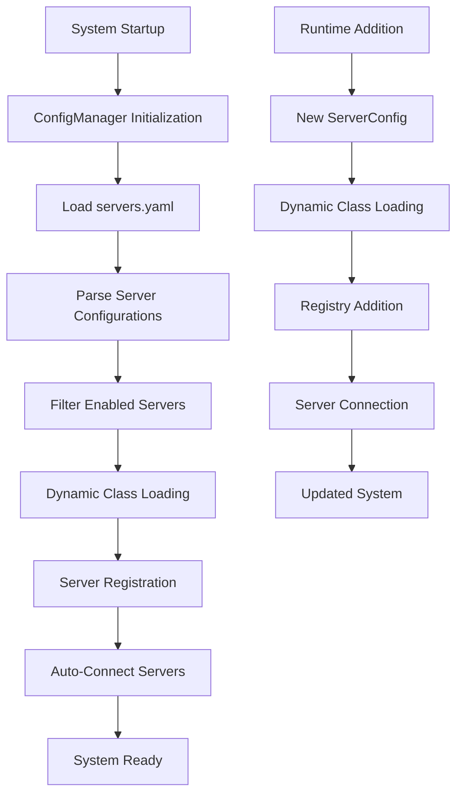

# Dynamic Server Discovery in MCP Architecture

## Overview

The MCP (Model Context Protocol) architecture implements a sophisticated **dynamic server discovery system** that allows new analysis servers to be added, configured, and loaded without requiring any code changes to the core system. This enables true plugin-like extensibility and scalability.

## How Dynamic Discovery Works

### 1. Configuration-Driven Architecture

The system uses YAML configuration files to define servers:

```yaml
# config/servers.yaml
scrnaseq:
  class_path: "src.mcp.servers.scrnaseq_server.scRNASeqMCPServer"
  enabled: true
  auto_connect: true
  strategy: "scrnaseq"
  priority: 1
  config:
    max_cells: 50000
    default_resolution: 0.5

proteomics:
  class_path: "src.mcp.servers.proteomics_server.ProteomicsMCPServer"
  enabled: false  # Can be enabled when needed
  auto_connect: false
  strategy: "proteomics"
  priority: 4
```

### 2. Dynamic Class Loading

The `ConfigManager` uses Python's `importlib` to load server classes dynamically:

```python
def load_server_class(self, class_path: str) -> Optional[Type]:
    """Dynamically load server class from path"""
    try:
        module_path, class_name = class_path.rsplit('.', 1)
        module = importlib.import_module(module_path)
        return getattr(module, class_name)
    except Exception as e:
        self.logger.error(f"Failed to load server class {class_path}: {e}")
        return None
```

### 3. Registry Integration

The `MCPRegistry` automatically discovers and loads configured servers:

```python
def _load_configuration(self):
    """Load server configurations from config manager"""
    enabled_configs = config_manager.get_enabled_servers()
    
    for server_config in enabled_configs:
        # Load server class dynamically
        server_class = config_manager.load_server_class(server_config.class_path)
        
        if server_class:
            self.register_server_config(
                name=server_config.name,
                server_class=server_class,
                enabled=server_config.enabled,
                auto_connect=server_config.auto_connect,
                config=server_config.config
            )
```

## Key Components

### 1. ConfigManager (`src/mcp/core/config.py`)

**Responsibilities:**
- Load server configurations from YAML files
- Validate configuration integrity
- Dynamically load server classes using importlib
- Manage server dependencies and priorities
- Save configuration changes

**Key Methods:**
- `get_enabled_servers()` - Get servers marked as enabled
- `load_server_class()` - Dynamically load server class from string path
- `register_server_config()` - Add new server configuration
- `validate_configuration()` - Check for configuration issues

### 2. MCPRegistry (`src/mcp/core/registry.py`)

**Responsibilities:**
- Initialize servers based on configuration
- Manage server lifecycle (connect/disconnect)
- Route tool calls to appropriate servers
- Aggregate context from all servers
- Health monitoring

**Key Methods:**
- `_load_configuration()` - Load servers from config manager
- `add_server_from_config()` - Add server dynamically
- `connect_server()` / `disconnect_server()` - Manage connections
- `get_server_status()` - Monitor server health

### 3. ServerConfig Dataclass

```python
@dataclass
class ServerConfig:
    name: str
    class_path: str  # e.g., "src.mcp.servers.scrnaseq_server.scRNASeqMCPServer"
    enabled: bool = True
    auto_connect: bool = True
    config: Dict[str, Any] = field(default_factory=dict)
    strategy: Optional[str] = None
    dependencies: List[str] = field(default_factory=list)
    priority: int = 1
```

## Discovery Process Flow



## Examples of Dynamic Discovery

### 1. Adding a New Analysis Type

**Step 1: Create Server Class**
```python
# src/mcp/servers/proteomics_server.py
class ProteomicsMCPServer(MCPServer):
    def __init__(self):
        super().__init__("proteomics", "1.0.0")
        # Register proteomics-specific tools
```

**Step 2: Add Configuration**
```yaml
# config/servers.yaml
proteomics:
  class_path: "src.mcp.servers.proteomics_server.ProteomicsMCPServer"
  enabled: true
  auto_connect: true
  strategy: "proteomics"
  priority: 4
  config:
    fdr_threshold: 0.01
    intensity_threshold: 1000
```

**Step 3: System Automatically Discovers**
- No code changes to core system required
- Server is loaded and connected on next startup
- Tools become available immediately

### 2. Runtime Server Addition

```python
# Add server dynamically at runtime
new_server = ServerConfig(
    name="custom_analysis",
    class_path="plugins.custom.CustomAnalysisServer",
    enabled=True,
    auto_connect=True
)

# Register and connect
config_manager.register_server_config(new_server)
success = mcp_registry.add_server_from_config("custom_analysis")
await mcp_registry.connect_server("custom_analysis")
```

### 3. Plugin Architecture Support

```yaml
# Third-party plugin configuration
custom_plugin:
  class_path: "plugins.third_party.AdvancedAnalysisServer"
  enabled: true
  auto_connect: true
  strategy: "advanced_analysis"
  priority: 100
  config:
    plugin_version: "2.1.0"
    license_key: "xxx-xxx-xxx"
    custom_params:
      algorithm: "proprietary_v2"
      optimization: "gpu_accelerated"
  dependencies: ["data", "visualization"]
```

## Benefits of Dynamic Discovery

### 1. **Zero-Code Extensibility**
- Add new analysis types without modifying core code
- Configuration-driven server management
- Plugin-like architecture for third-party extensions

### 2. **Scalability**
- Support hundreds of analysis types
- Lazy loading - only load what's needed
- Priority-based server ordering

### 3. **Maintainability**
- Clear separation between core system and analysis logic
- Configuration validation prevents errors
- Centralized server management

### 4. **Flexibility**
- Enable/disable servers without code changes
- Runtime server addition and removal
- Configurable server parameters

### 5. **Robustness**
- Graceful handling of missing classes
- Fallback to default servers on configuration errors
- Health monitoring and validation

## Configuration Options

### Server Configuration Fields

| Field | Type | Description | Example |
|-------|------|-------------|---------|
| `name` | string | Unique server identifier | `"scrnaseq"` |
| `class_path` | string | Python import path to server class | `"src.mcp.servers.scrnaseq_server.scRNASeqMCPServer"` |
| `enabled` | boolean | Whether server should be loaded | `true` |
| `auto_connect` | boolean | Connect automatically on startup | `true` |
| `strategy` | string | Analysis strategy to use | `"scrnaseq"` |
| `priority` | integer | Loading/connection priority | `1` |
| `config` | object | Server-specific configuration | `{"max_cells": 50000}` |
| `dependencies` | array | Required servers | `["data", "visualization"]` |

### Global Configuration

```yaml
# config/mcp_config.yaml
mcp:
  client_name: "bioinformatics_platform"
  cache:
    enabled: true
    max_size: 1000
    default_ttl: 300
  connection:
    timeout: 30
    retry_attempts: 3
    retry_delay: 1

logging:
  level: "INFO"
  format: "%(asctime)s - %(name)s - %(levelname)s - %(message)"
```

## Error Handling and Validation

### 1. Configuration Validation
```python
def validate_configuration(self) -> List[str]:
    """Validate configuration and return list of issues"""
    issues = []
    
    for name, config in self.server_configs.items():
        # Check if class can be loaded
        server_class = self.load_server_class(config.class_path)
        if server_class is None:
            issues.append(f"Server {name}: Cannot load class {config.class_path}")
        
        # Check dependencies
        for dep in config.dependencies:
            if dep not in self.server_configs:
                issues.append(f"Server {name}: Missing dependency {dep}")
    
    return issues
```

### 2. Graceful Fallbacks
- If configuration loading fails, fall back to default servers
- If a server class can't be loaded, log warning and continue
- If server connection fails, mark as unhealthy but don't crash system

### 3. Health Monitoring
```python
async def health_check(self) -> Dict[str, bool]:
    """Perform health check on all connected servers"""
    health_status = {}
    for server_name in self.server_configs:
        try:
            # Ping server or check specific health endpoint
            healthy = await self._check_server_health(server_name)
            health_status[server_name] = healthy
        except Exception:
            health_status[server_name] = False
    return health_status
```

## Best Practices

### 1. **Server Development**
- Inherit from `MCPServer` base class
- Implement required abstract methods
- Use consistent naming conventions
- Include comprehensive error handling

### 2. **Configuration Management**
- Use descriptive server names
- Set appropriate priorities
- Document configuration options
- Validate configurations before deployment

### 3. **Dependency Management**
- Declare server dependencies explicitly
- Use priority ordering for load sequence
- Handle circular dependencies gracefully

### 4. **Plugin Development**
- Follow established patterns
- Include version information
- Provide clear documentation
- Test with core system

## Future Enhancements

### 1. **Hot Reloading**
- Reload server classes without restart
- Update configurations dynamically
- Graceful server replacement

### 2. **Service Discovery**
- Automatic discovery of available servers
- Network-based server registration
- Distributed server architecture

### 3. **Advanced Validation**
- Schema validation for configurations
- Compatibility checking between servers
- Performance impact analysis

### 4. **Monitoring and Metrics**
- Server performance monitoring
- Usage analytics
- Automated health reporting

## Conclusion

The dynamic server discovery system in the MCP architecture provides a robust, scalable foundation for extending bioinformatics analysis capabilities. By separating configuration from code and using dynamic loading, the system can grow to support hundreds of analysis types without increasing complexity or maintenance burden.

This architecture enables:
- **Rapid development** of new analysis capabilities
- **Easy deployment** of third-party plugins
- **Scalable growth** without architectural changes
- **Maintainable codebase** with clear separation of concerns

The system demonstrates how thoughtful architecture can solve scalability challenges while maintaining simplicity and reliability. 